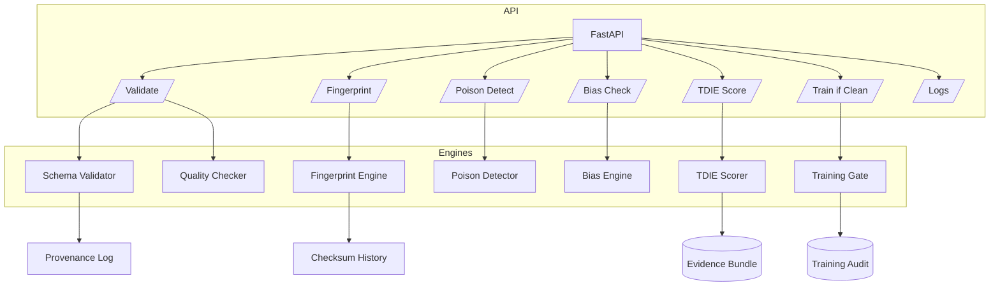

# Training Data Integrity Engine (TDIE)

TDIE is a synthetic-safe platform that validates datasets, detects tampering/poisoning, enforces data contracts, fingerprints versions, and calculates integrity scores aligned to NIST AI RMF and ISO/IEC 42001. It is designed to be educational, privacy-preserving, and production-ready.

## Features
- **Schema + contract enforcement** with Pydantic models.
- **Data quality checks** for nulls, outliers (IQR + z-score), duplicates, timestamp anomalies, and drift vs. a baseline.
- **Dataset fingerprinting & provenance** with SHA-256 hashes, lineage tracking, and history persistence.
- **Simulated poisoning/bias detection** including class imbalance jumps, clustering anomalies, and fairness heuristics.
- **Guardrails & scoring** that combine quality, schema, poisoning, bias, and provenance completeness into a TDIE score with BLOCK/REVIEW/PASS decisions.
- **FastAPI backend & dashboard** for quick exploration plus evidence bundle generation for compliance trails.

## Architecture


## Quickstart
```bash
python -m venv .venv
source .venv/bin/activate
pip install -r requirements.txt
uvicorn backend.main:app --reload
```
Visit `http://localhost:8000/docs` for the interactive API reference.

For local development with linters and formatters:

```bash
pip install -r requirements-dev.txt
make lint  # ruff + black checks
make test  # pytest suite
```

## API Endpoints
| Method | Path | Purpose |
| --- | --- | --- |
| POST | `/validate_dataset` | Validate schema compliance and produce data quality report. |
| POST | `/fingerprint` | Generate dataset and per-feature hashes plus provenance entry. |
| POST | `/poison_detect` | Run simulated poisoning/gradient/backdoor heuristics. |
| POST | `/bias_check` | Compute fairness gaps and bias integrity score. |
| POST | `/tdie_score` | Aggregate integrity signals into TDIE score, severity, and decision. |
| POST | `/train_if_clean` | Enforce guardrails and block/review/pass training. |
| GET | `/logs` | Retrieve recent application logs for auditability. |
| GET | `/health` | Liveness probe used by CI and deployment platforms. |

## Example Payload
```json
{
  "schema": {
    "name": "synthetic_demo",
    "version": "1.0",
    "fields": [
      {"name": "id", "dtype": "int", "required": true},
      {"name": "value", "dtype": "float", "required": true, "min_value": 0, "max_value": 50},
      {"name": "group", "dtype": "str", "required": true},
      {"name": "label", "dtype": "int", "required": true},
      {"name": "timestamp", "dtype": "datetime", "required": true}
    ]
  },
  "records": [
    {"id": 1, "value": 12.5, "group": "A", "label": 1, "timestamp": "2024-01-01T00:00:00"},
    {"id": 2, "value": 9.7, "group": "B", "label": 0, "timestamp": "2024-01-02T00:00:00"}
  ],
  "source": "synthetic",
  "user": "demo",
  "transformation_steps": ["scaling", "normalization"]
}
```

## TDIE Scoring
The TDIE score blends quality, schema adherence, poisoning risk, bias integrity, and provenance completeness. Severity tiers map to automated guardrails:
- **Low (PASS):** score >= 80
- **Medium (REVIEW):** 60–79
- **High/Critical (BLOCK):** score < 60 or hard schema failures

## Repository Layout
- `backend/` FastAPI app, API routers, and integrity engines
- `frontend/` Static dashboard assets
- `data/` Baseline synthetic datasets
- `logs/` Runtime logs and audit artifacts (see `logs/README.md`)
- `provenance/` Fingerprint and lineage stores (see `provenance/README.md`)
- `docs/` Architecture, API, fairness, threat model, and provenance notes
- `tests/` Pytest suite

## Development Standards
- Python 3.11+, FastAPI, Pydantic, NumPy/Scikit-learn for simple heuristics.
- Type hints and docstrings on all classes/functions.
- Logging via `backend.utils.logger` with rotating files under `logs/`.
- Safety: only synthetic/anonymized data; no outbound network calls; simulated threat intel.
- Run formatting and tests before committing.

## Testing
```bash
pytest
```

## Deployment Notes
- Default settings are file-based for simplicity; mount persistent volumes for `logs/` and `provenance/` in production.
- Configure reverse proxies or API gateways to enforce authentication/authorization as needed.

## Compliance Mapping (high level)
- **NIST AI RMF**: Govern (policy docs), Map (provenance), Measure (quality/bias/poison metrics), Manage (training gate decisions).
- **ISO/IEC 42001**: Data integrity controls, auditability via evidence bundles, and risk management via scoring/guardrails.

## Safety Guardrails
- Only synthetic/anonymized data; no PII.
- Threat checks are simulated and non-destructive.
- Logs redact sensitive fields and never exfiltrate data.

## License
MIT License. See [LICENSE](LICENSE).
